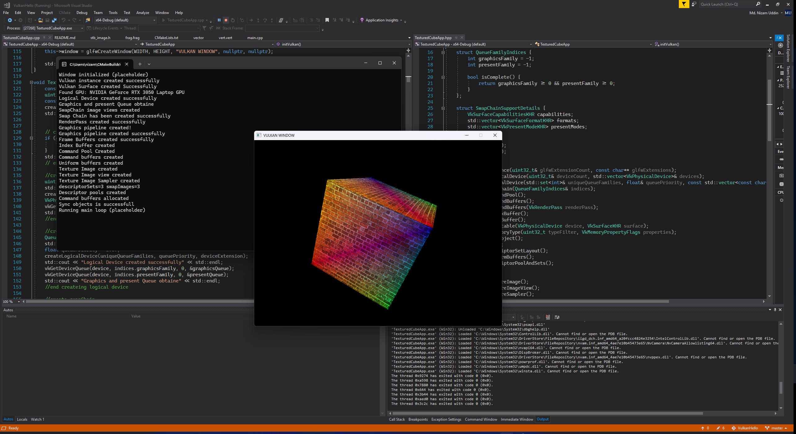

# 🌀 Vulkan Textured Cube

A minimal Vulkan project written in **C++17** that renders a textured cube using the Vulkan API, GLFW for windowing, and GLAD for loading Vulkan function pointers.  
This project is intended as a step-by-step journey into Vulkan graphics programming.

---

## 📋 Prerequisites

Make sure the following are installed:

- [Vulkan SDK](https://vulkan.lunarg.com/sdk/home) (1.4.x or newer recommended)  
- [CMake](https://cmake.org/download/) (≥ 3.10)  
- [GLFW](https://www.glfw.org/download.html)  
- [GLAD](https://glad.dav1d.de/) (pre-generated Vulkan loader)  
- A C++17 compiler (Visual Studio 2017+, GCC, or Clang)  

---

##  Clone the Repository and create a build directory
```bash
mkdir build
cd build
```

##  Run CMake:
```bash 
cmake ..
cmake --build .
```

##Run the application:
```bash
TexturedCubeApp.exe
```
---

## Project Structure
```bash 
├── CMakeLists.txt         # Build configuration
├── external/              # Third-party libs (GLFW, GLAD, stb_image, etc.)
├── shaders/               # Vertex & fragment shaders (compiled with glslc)
├── assets/                # Texture images (tracked via Git LFS if large)
├── src/
│   ├── TexturedCubeApp.hpp
│   ├── TexturedCubeApp.cpp
│   └── main.cpp
└── README.md
```
---

## Further Modification
You can open this project in your visual studio and modify according to your wish

---

##Output
[▶Watch the demo video on Google Drive](https://drive.google.com/file/d/1vcL_xPUbLJk3AOCkBchB2sbul4h4D7r8/view?usp=drive_link)

 ##Image


---